<p align="center">
  
</p>

<p align="center">
  <b>Virtual power plant arbitrage engine.</b><br/>
  Two dispatch strategies race each other on real ERCOT market data, in your browser.
</p>

<p align="center">
  <a href="https://fluxcore-30a.pages.dev"><b>Live demo</b></a> -
  <a href="#the-tdd-story">TDD story</a> -
  <a href="#architecture">Architecture</a> -
  <a href="#running-locally">Run it</a>
</p>

---

## What it is

fluxcore simulates a **virtual power plant (VPP)**: 200 homes, each with a
13.5 kWh battery, 5 kW of inverter, and 5 kW of rooftop solar, aggregated into
a single 2.7 MWh / 1 MW dispatchable resource. The simulator replays real
15-minute settlement prices from ERCOT's HB_NORTH hub and lets two trading
strategies compete on the same fleet, tick for tick:

| Strategy | How it decides |
| --- | --- |
| **Threshold** | Reactive baseline. Tracks a rolling mean of recent real-time prices and charges below / discharges above a $20 band, with a breakeven guard that accounts for round-trip efficiency and battery degradation. |
| **LP Optimizer** | Forward-looking. Every simulated hour it solves a linear program over the next 24 hours of day-ahead market prices (slot 0 pinned to the live real-time price), maximizing profit subject to cumulative state-of-charge constraints. |

Each strategy gets its own cloned fleet and its own P&L ledger, so the
comparison is honest: same prices, same hardware, different brains.

### Scenarios (all real data)

| Scenario | Window | RT price range |
| --- | --- | --- |
| Heat Wave / Aug 2023 | 7 days, Aug 2023 | $4.17 to **$5,193.14**/MWh |
| Shoulder Season / Apr 2024 | 7 days, Apr 2024 | **-$30.72** to $497.67/MWh |
| Winter Storm Heather / Jan 2024 | 7 days, Jan 2024 | -$1.18 to $1,172.71/MWh |

Negative prices are real - in the shoulder season ERCOT will pay you to
consume. Both strategies happily charge at negative prices.

## Screenshots

**Desktop** - heat wave scenario after a multi-day run at 24 simulated
hours/second. Note the dispatch markers on the price spike and the P&L strip:

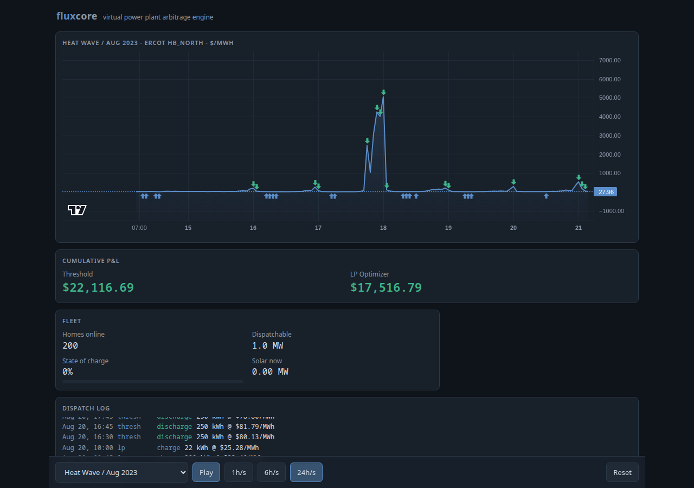

**Mobile** - the layout is mobile-first; the control bar wraps and stays
thumb-reachable:

<p align="center">
  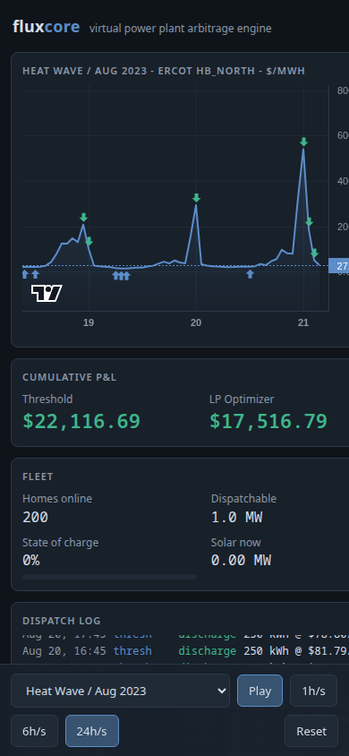
</p>

A fun, honest result: on the 2023 heat wave the simple **Threshold strategy
beats the LP Optimizer** ($22,116 vs $17,516). The LP plans against day-ahead
forecasts, and the real-time spikes blew far past what the day-ahead market
predicted - the 15-minute reactive strategy caught spikes the hourly plan
missed. Optimization is only as good as its forecast.

---

## The TDD story

This project was built **strictly test-first**, module by module. Every core
module followed the same red-green-refactor loop, and we captured the terminal
output of each phase as it happened:

1. **RED** - write the test for behavior that does not exist yet. Run it.
   Watch it fail *for the right reason* (module not found / assertion fails,
   not a typo).
2. **GREEN** - write the minimal implementation that makes the test pass.
   Run it. Watch it pass.
3. **REFACTOR** - clean up with the tests as a safety net, then commit.

The screenshots below are the actual captured runs, in build order. Every
"RED" capture shows vitest failing because the implementation file literally
does not exist yet - the import cannot resolve. That is the proof the test
came first.

### 1. Scenario parser (`src/core/scenario.ts`)

The only JSON boundary in the app. `parseScenario(raw: unknown)` validates
untrusted fetched data and throws on anything malformed - everything past this
point trusts its types.

**RED** - the test imports `../scenario`, which does not exist:

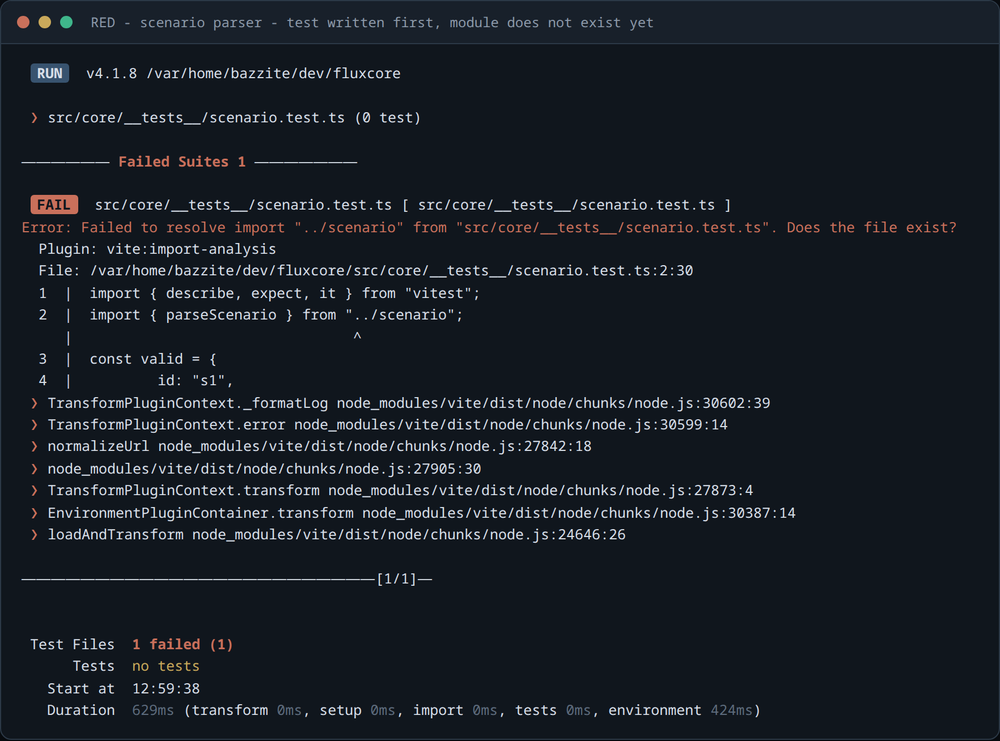

**GREEN** - minimal parser, 4 tests:

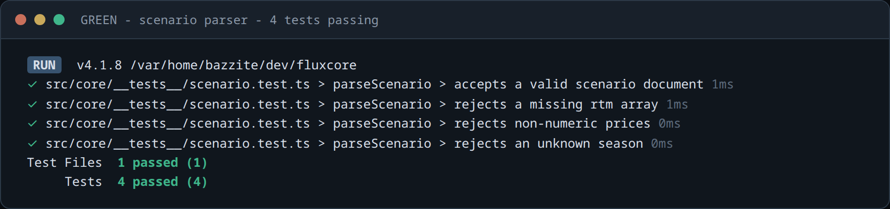

### 2. Battery model (`src/core/battery.ts`)

The physics core. Charging applies 86% round-trip efficiency on the way in,
clamps to inverter rate and remaining headroom, and *reduces grid draw to
match* what actually fits. Discharge clamps to rate and state of charge.

**RED**:

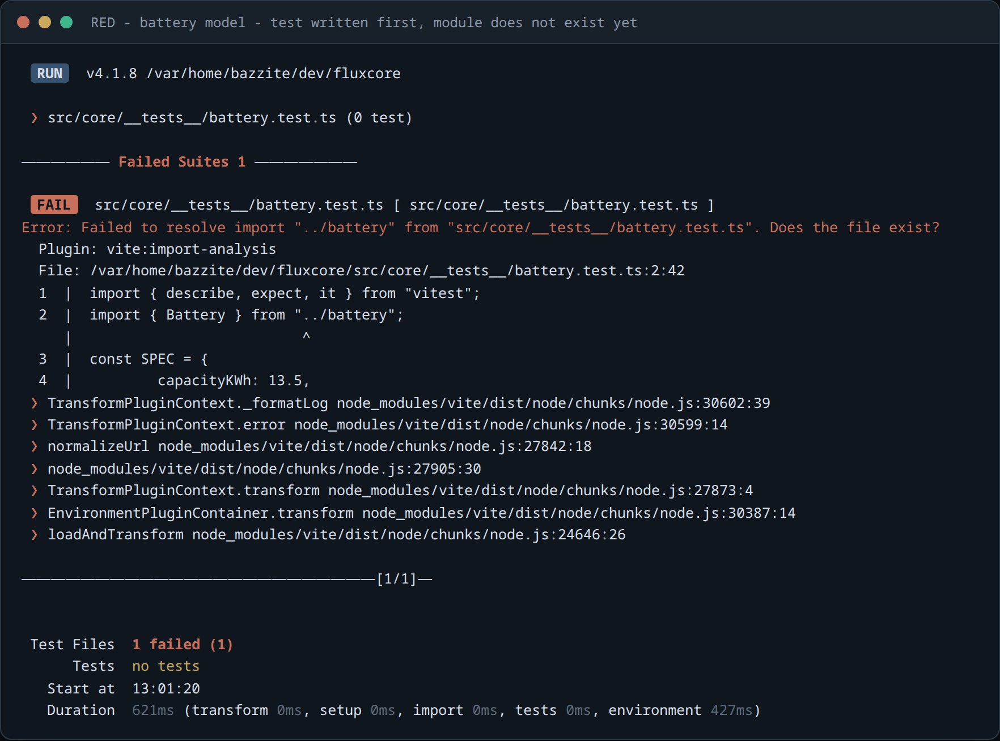

**GREEN** - 7 tests covering every clamp path:

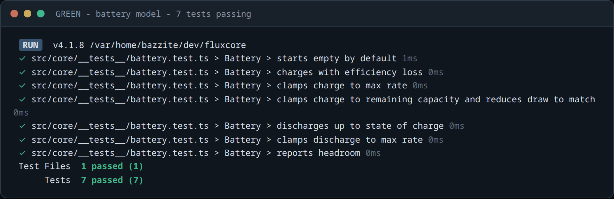

### 3. Solar curve (`src/core/solar.ts`)

Clear-sky sine approximation with seasonal daylight windows (summer 06-20,
shoulder 07-19, winter 08-18). Zero outside the window, peak at solar noon.

**RED**:

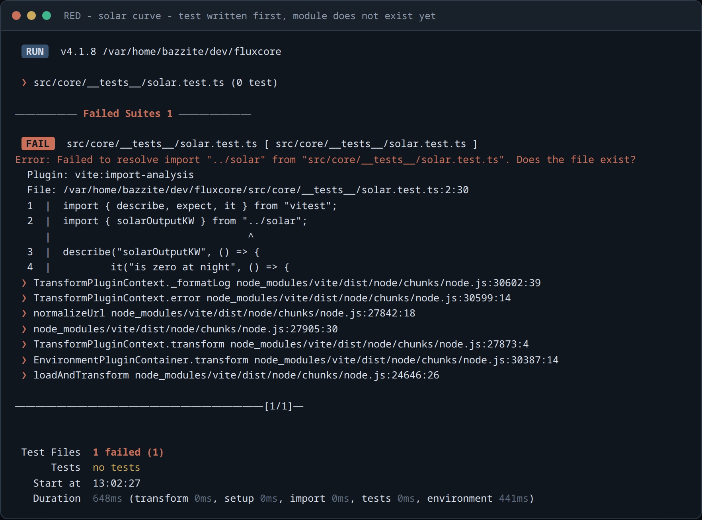

**GREEN**:

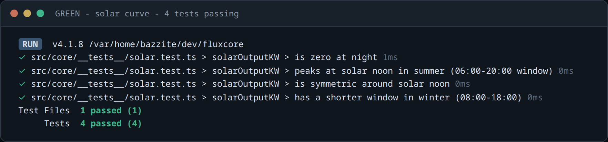

### 4. Fleet aggregation (`src/core/fleet.ts`)

200 batteries behaving as one plant. Charge commands fan out proportional to
headroom, discharge proportional to state of charge, and solar charges the
fleet for free before each market decision.

**RED**:

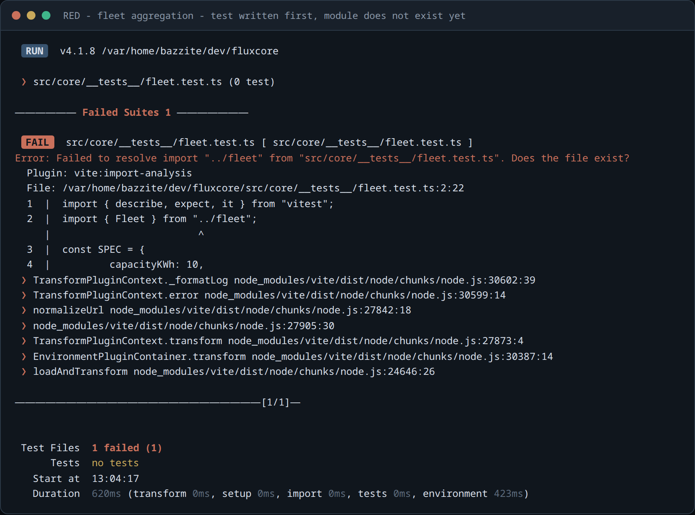

**GREEN** - 7 tests:

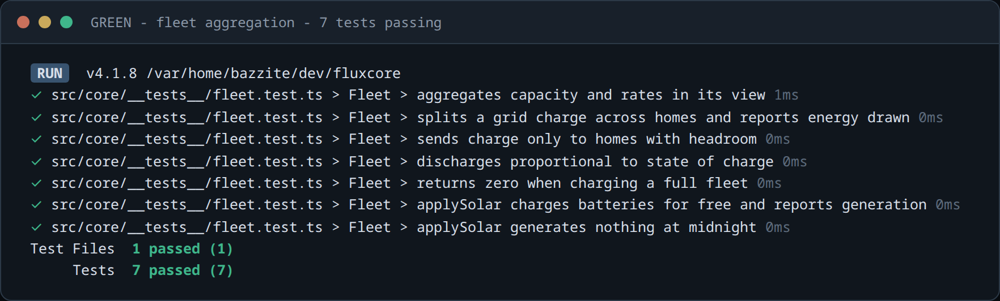

### 5. Market clock (`src/core/clock.ts`)

Deterministic replay stepper over the price series: `next`, `current`,
`history`, `progress`, `done`, `reset`.

**RED**:

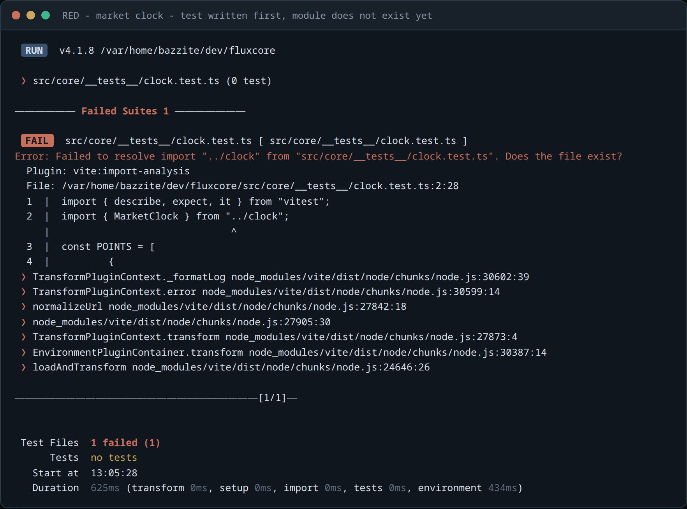

**GREEN**:

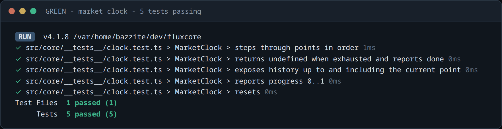

### 6. Threshold strategy (`src/core/threshold.ts`)

The baseline trader. Rolling-mean band logic plus a breakeven guard:
`mean / efficiency + degradation` - it refuses to discharge below the price
where the round trip actually loses money.

**RED**:

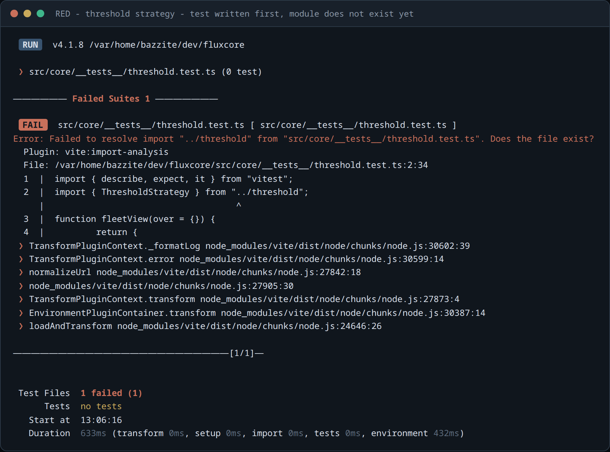

**GREEN** - 6 tests:

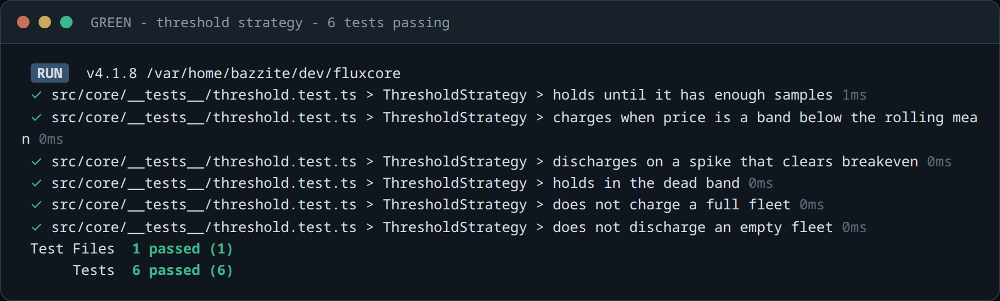

### 7. LP optimizer strategy (`src/core/lp.ts`)

Builds a profit-maximizing linear program (via `javascript-lp-solver`) over a
24-hour day-ahead horizon, re-solved each simulated hour. Cumulative SoC
constraints keep the plan physically feasible: every prefix of the plan must
respect capacity and never go below empty.

**RED**:

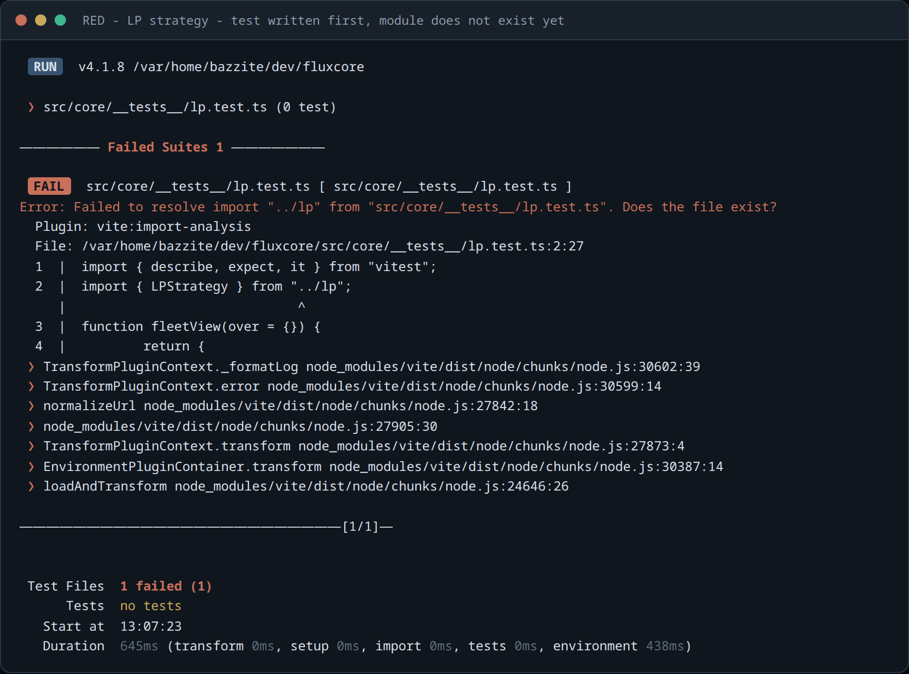

**GREEN** - 5 tests, including "charges now when a big spike is coming later"
and "does not discharge an empty fleet even if the plan says to":

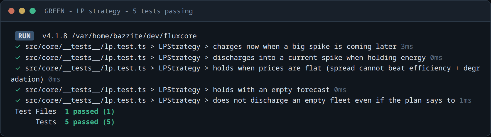

### 8. P&L ledger (`src/core/ledger.ts`)

Records every dispatch with strategy, MWh, price, and dollar value; exposes
running P&L and a recent tail for the UI log.

**RED**:

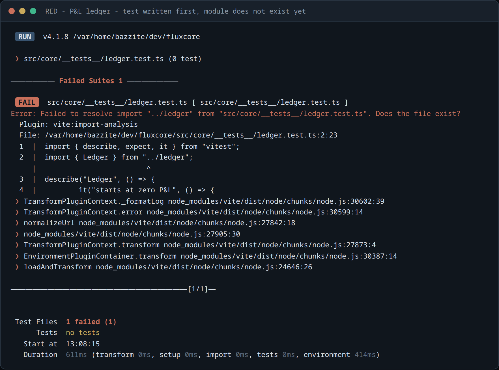

**GREEN**:

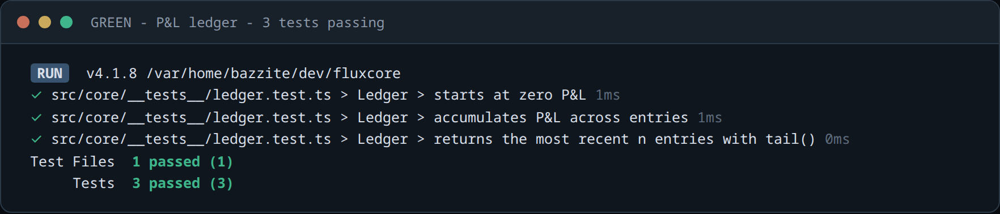

### 9. Simulation controller (`src/core/controller.ts`)

The conductor. Each `tick()` advances the clock, applies solar, asks every
strategy for a decision against its own cloned fleet, executes it, books it to
that strategy's ledger, and emits an immutable snapshot for the UI.

**RED**:

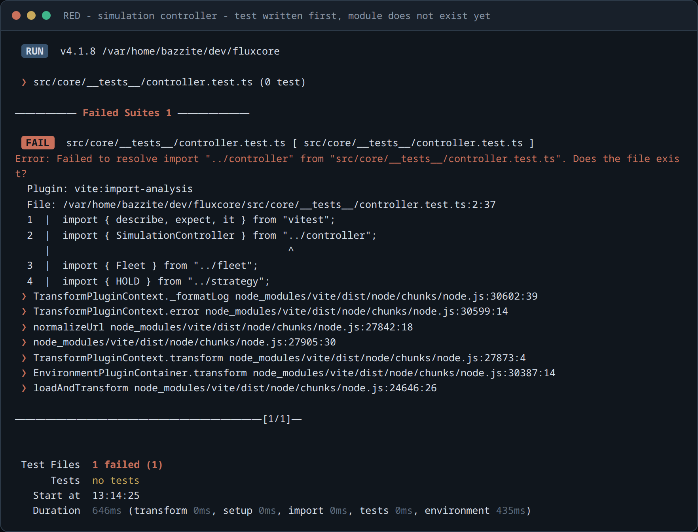

**GREEN**:

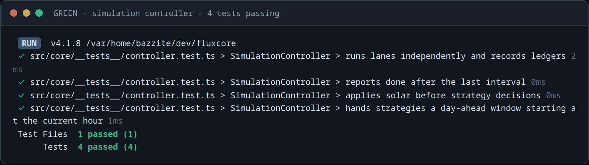

### 10. Real data integrity (`src/core/__tests__/data.test.ts`)

The bundled ERCOT JSON is itself under test: every scenario file must parse
through `parseScenario`, contain a full week of 15-minute RT points and hourly
DAM points, with timestamps strictly increasing.

**GREEN** (data files are generated artifacts - the tests gate them, the
red phase here was the ingest script erroring until the data was right):

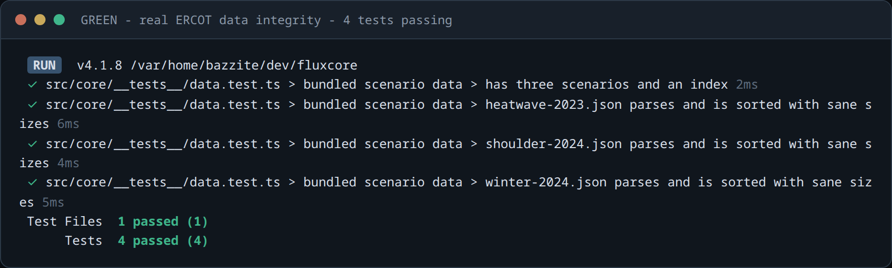

### 11. UI components (`src/ui/components/`)

Rendered-output tests via Testing Library: the P&L strip formats dollars and
signs correctly, the fleet panel reports homes and SoC, the dispatch log
renders entries.

**RED** - three components imported, none exist:

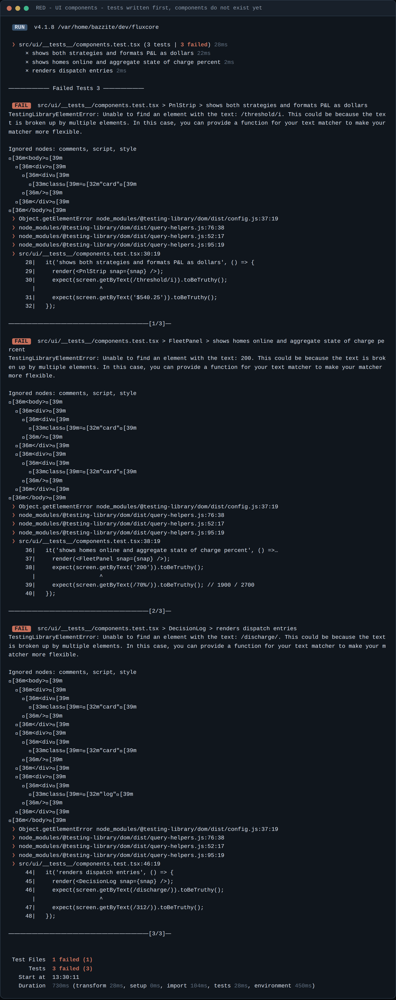

**GREEN**:

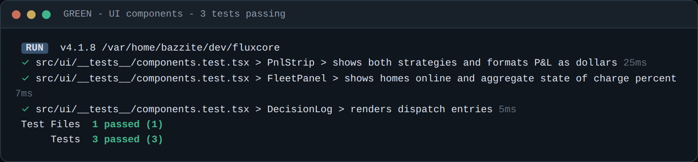

### The full suite

**52 tests across 11 files**, all green, about a second of test time:

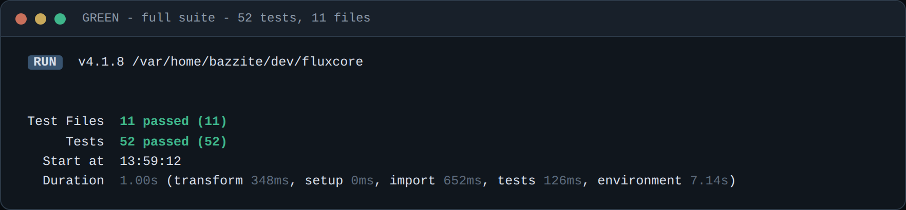

### TDD in the commit history

The git log reads as the build order - one tested module per commit, test and
implementation landing together, with the raw red/green terminal captures
checked in under [`docs/tdd/logs/`](docs/tdd/logs/):

```
b81e091 feat: scenario types and boundary parser
3a2e0b7 feat: battery state machine with rate, capacity, efficiency clamping
c0215cf feat: clear-sky solar generation profile
87314ca feat: fleet aggregation with proportional dispatch and free solar charging
8f3b2d9 feat: market clock replay stepper
790d761 feat: threshold baseline strategy with breakeven guard
0d5903a feat: LP optimizer strategy over day-ahead horizon
0733344 feat: dispatch ledger with running P&L
e8f0dae feat: simulation controller with per-strategy lanes
e9d7694 feat: ingest script and bundled real ERCOT scenario data
4975433 feat: app shell, design tokens, simulation hook
ed272ef feat: dashboard components with live chart and dispatch markers
```

What TDD bought us, concretely:

- **The efficiency bug that never shipped.** Writing the battery test first
  forced the question "is efficiency applied on charge or discharge?" before
  any code existed. The test pinned it (charge), and every later module
  inherited a consistent answer.
- **Fearless refactoring.** The simulation hook was rewritten from a
  `useRef`/effect pattern to React's render-time-adjustment pattern to satisfy
  a strict lint rule - and the deterministic P&L ($22,116.69 / $17,516.79)
  came out identical before and after. The suite proved the refactor changed
  nothing.
- **Data you can trust.** When the ERCOT ingest was rewritten (the original
  API path only retained recent days), the data tests defined what "valid
  scenario data" meant before the new ingest produced a single file.

---

## Architecture

Two layers with a hard boundary:

```
src/
  core/          pure TypeScript, zero browser imports, 100% unit tested
    types.ts        PricePoint, Season, Scenario
    scenario.ts     parseScenario - the only untrusted-JSON boundary
    battery.ts      single battery: rate/capacity/efficiency clamping
    solar.ts        clear-sky seasonal generation curve
    fleet.ts        N batteries as one plant, proportional dispatch
    clock.ts        deterministic price-series replay
    strategy.ts     Strategy interface, MarketContext, Action
    threshold.ts    reactive rolling-band trader
    lp.ts           24h day-ahead linear-program trader
    ledger.ts       per-strategy dispatch ledger and P&L
    controller.ts   per-tick orchestration, immutable snapshots
  ui/            React shell - consumes snapshots, owns no business logic
    useSimulation.ts   play/pause/speed/reset, accumulator tick loop
    App.tsx            layout + data fetch
    components/        PriceChart, PnlStrip, FleetPanel, DecisionLog, ControlBar
```

The core never imports from the UI, never touches the DOM, and runs identically
under node. The UI is a thin projection of `SimSnapshot` objects - which is
why the whole engine is unit-testable and the simulation is deterministic.

### Design decisions worth knowing

- **Efficiency on charge, once.** 86% round-trip applied when energy enters
  the battery. Simpler ledger math, same economics.
- **Degradation as a dispatch cost.** $20/MWh throughput cost baked into both
  strategies' breakeven logic, so neither one churns the batteries for pennies.
- **Hour-of-day is fixed UTC-6.** ERCOT does not observe market DST for
  settlement intervals in any way that matters at demo scale; a fixed offset
  keeps solar alignment honest and the code free of timezone libraries.
- **Speeds are simulated hours per second** (1, 6, 24), not abstract
  multipliers. At 24 h/s a full week plays in about 7 seconds.

## Real ERCOT data

`scripts/ingest/fetch_ercot.py` (Python, [gridstatus](https://github.com/gridstatus/gridstatus))
pulls **annual ERCOT archives** for real-time and day-ahead settlement point
prices, filters to the HB_NORTH hub, slices the scenario windows, and emits
the JSON bundles in `public/data/`. Each bundle is 672 fifteen-minute RT
points + 168 hourly DAM points. The bundles are committed - the app needs no
backend and no API keys at runtime.

```bash
python3 scripts/ingest/fetch_ercot.py   # regenerate public/data/*.json
```

## Security

Static site, defense-in-depth anyway (`public/_headers`, served by Cloudflare
Pages):

- Strict CSP: `default-src 'self'`, **no `unsafe-inline`** for scripts or
  styles, `frame-ancestors 'none'`, `base-uri 'none'`, `form-action 'none'`
- HSTS (1 year, includeSubDomains), `X-Frame-Options: DENY`,
  `X-Content-Type-Options: nosniff`, COOP `same-origin`
- Restrictive Referrer-Policy and Permissions-Policy
- The single JSON boundary is schema-validated (`parseScenario`) before any
  data reaches the engine
- GitHub Actions pinned to full commit SHAs; CI runs `npm audit
  --audit-level=high` (currently 0 vulnerabilities)

## CI/CD

`.github/workflows/ci.yml`:

- **test job** (every push and PR): typecheck, lint, full vitest suite, build,
  audit
- **deploy job** (pushes to `main` only, gated on test): builds and deploys
  `dist/` to Cloudflare Pages via wrangler
- `main` is branch-protected: the `test` check must pass before merge

## Running locally

```bash
npm ci
npm run dev        # vite dev server
npm test           # full suite (52 tests)
npm run test:watch # red-green loop, the way this repo was built
npm run typecheck
npm run lint
npm run build && npm run preview
```

## Team

Built as a 2-day collaborative project by
[@melonmelonz](https://github.com/melonmelonz),
[@DBusch-Developer](https://github.com/DBusch-Developer), and
[@windwardline](https://github.com/windwardline).
